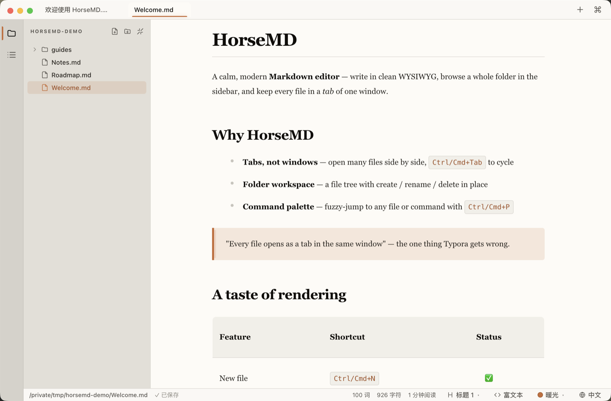
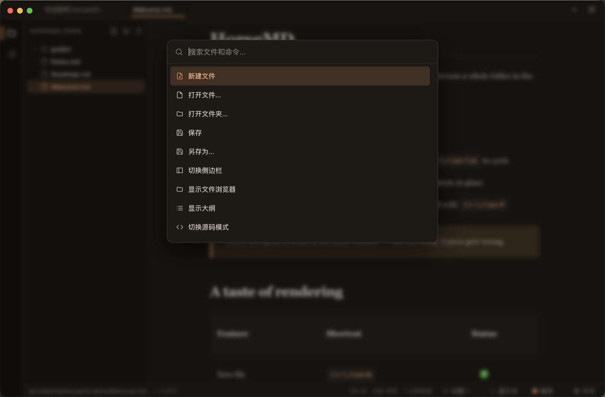
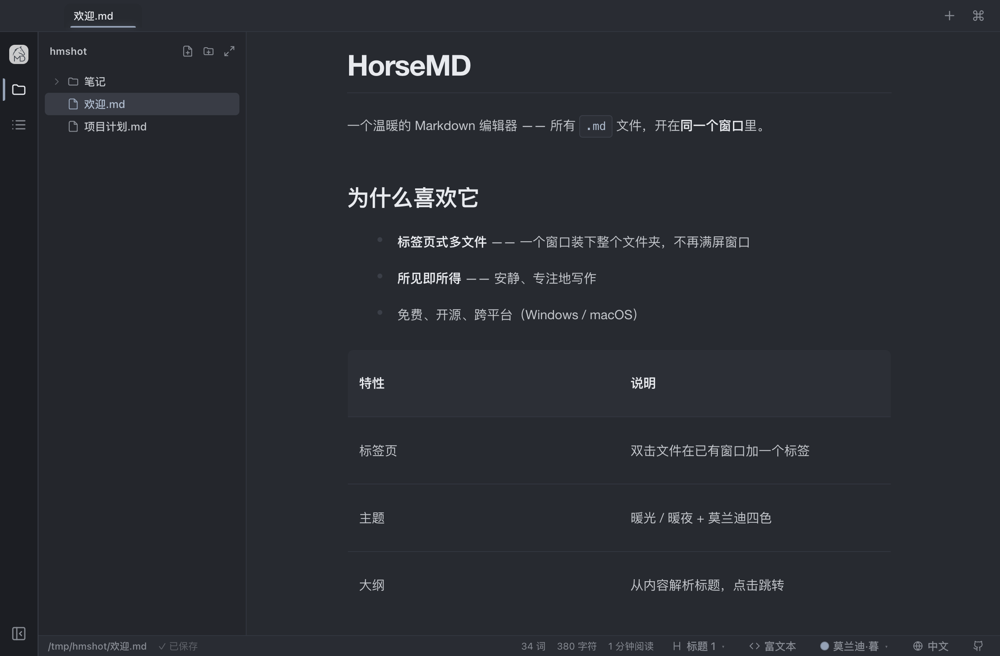
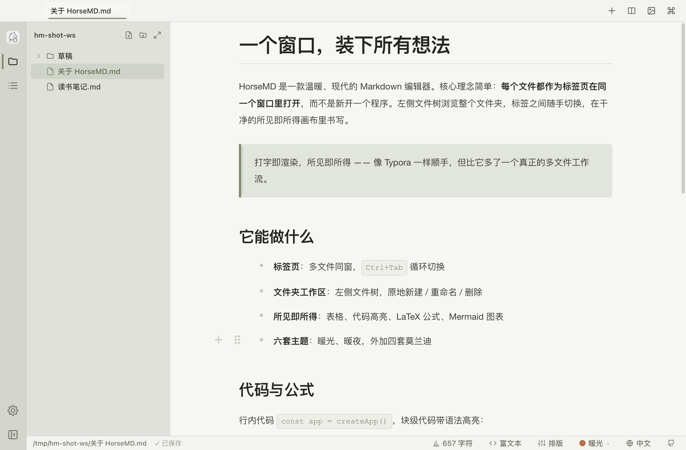
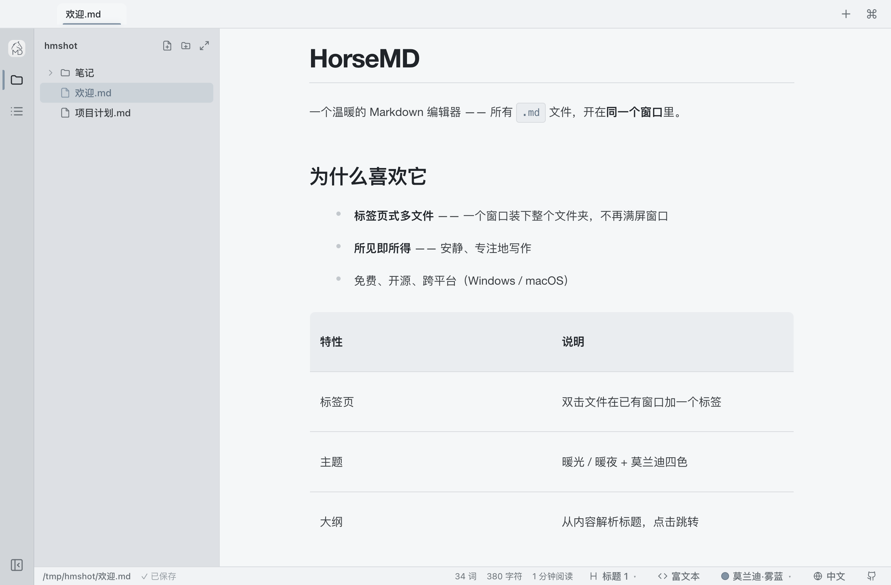

# HorseMD

[](https://github.com/BND-1/horseMD/actions/workflows/ci.yml)
[](https://github.com/BND-1/horseMD/releases)
[](./LICENSE)

> **GitHub**: [BND-1/horseMD](https://github.com/BND-1/horseMD) ·
> **Gitee (China mirror)**: [yty11167/horse-md](https://gitee.com/yty11167/horse-md) ·
> **Website**: [horsemd.yangsir.net](https://horsemd.yangsir.net)

**English** · [简体中文](./README.md)

A calm, modern **Markdown editor** — a Typora alternative built around the one
thing Typora gets wrong: **every file opens as a tab in the same window**, not a
new app instance. Browse a whole folder in the sidebar, flip between files in
tabs, and write in a clean WYSIWYG editor.



## Why HorseMD

Most Markdown editors make you choose between a beautiful WYSIWYG canvas and a
real multi-file workflow. HorseMD gives you both: a **single window** that holds
your whole folder in a file tree, every open document in a **tab**, and an
in-place live-preview editor powered by [Milkdown](https://milkdown.dev/)
(ProseMirror). It runs on **Windows, macOS, and Linux**, with a shared mobile
renderer for iOS and Android, and the whole interface speaks both **English and 中文**.

## Features

> Current stable release: **v0.10.4**. See the full [release notes](./docs/release-v0.10.4.md).

**Editing — everything Typora has**

- Seamless **WYSIWYG live preview** — type Markdown, see it render in place
- Slash menu (`/`) for inserting blocks; smart lists, selection toolbar, link tooltips
- Tables (**with in-cell line breaks**, natural sizing, on-demand horizontal scroll, and live hold-to-resize columns), fenced **code blocks with syntax highlighting**, **LaTeX math**, **Mermaid diagrams**, images, task lists, blockquotes
- **Configurable image host** — paste / drop / upload an image and it runs your upload command (Typora-style), inserting the returned URL
- **Source mode** toggle (`Ctrl/Cmd+/`) for raw Markdown — preserves the reading viewport or a visible editing caret, including tables, lists, code blocks, and large documents
- **Plain-text files (`.txt`) open in a fast plain editor** — no markdown reflow, instant on huge files
- Rich-text copy with inline styles (paste into WeChat / email / Notion keeps formatting)
- **Browser-style PDF export studio** (`Ctrl/Cmd+Shift+E`) — real paginated preview with paper, orientation, margins, scale, contents page, bookmarks, headers/footers, page numbers and ranges; no editor chrome in the output
- Relative-path images resolve against the file's folder (display only — your file stays untouched)
- **Double-click an image to view it enlarged** in a lightbox (Esc / click to close)
- **Raw HTML tables** (`<table>…</table>` in the Markdown) render as real tables, like Typora — display only, the source is preserved
- **CriticMarkup review marks** — additions, deletions, substitutions, and comments remain readable in Markdown and can be accepted or rejected individually or in bulk

**Beyond Typora**

- **Tabs** — many files in one window (`Ctrl/Cmd+Tab` to cycle); a `+` in the top bar for a new doc; right-click a tab to copy its path / name, reveal it in Finder/Explorer, or close others
- **Split view** — two documents side by side, both editable (right-click a tab → "Open in Split", or the split button in the top bar; close with the ✕ on the right pane)
- **Adjustable editor width** — status-bar presets (Narrow/Medium/Wide/Full) + a fine-tune slider
- **Document and code fonts** — choose separately from installed system fonts, with search and live preview
- **Composable Custom CSS** — enable, reorder, rename, and remove named CSS snippets; the expanded settings preview covers common Markdown elements, and desktop can inspect real document selectors
- **Custom themes** — drop a `.css` into the themes folder; **Typora themes work directly**
- **Unsaved scratch tabs survive a restart** — a new, never-saved doc is still there next time you open HorseMD
- **Folder workspace** — a file tree with create / rename / duplicate / delete / reveal / export-PDF, plus **drag-and-drop to move** and expand-all / collapse-all
- **Cloud-sync folders** — explicitly connect an existing local folder to WebDAV or S3-compatible storage, with upload/download, joining, two-way sync, previews, and conflict preservation; ordinary workspaces are never uploaded automatically
- **Open in the same window** — double-clicking a file in Finder/Explorer adds a tab; "Open with HorseMD" on a folder opens it as a workspace
- **Command palette** (`Ctrl/Cmd+P`) — fuzzy-jump to any file or command
- **Find in file** (`Ctrl/Cmd+F`) — highlights matches in the document with a live count
- **Outline panel** (`Ctrl+Shift+L`) — jump, expand/collapse by level, and drag-reorder sibling sections; when the side outline is closed, a quiet floating chapter navigator is available at the right edge
- **Custom keyboard shortcuts** — record, clear, or restore application shortcuts with conflict feedback; menus and in-editor commands share the same effective configuration
- **Settings center** — typography, fonts, Custom CSS, appearance, files and image hosting, cloud sync, keyboard shortcuts, spellcheck, language, and about
- Live word / character count & reading time
- Session restore — reopens your folder and tabs
- Auto-refreshing file tree & open files — watches for external changes and clearly warns before an external save could overwrite local unsaved edits
- **Home button** in the activity bar — back to the welcome page anytime (open tabs stay loaded)
- **Loading skeleton** for large documents, so opening a big file isn't a blank pause
- Unsaved-changes warning when closing the window or quitting (not just closing a tab)
- Notify-only update check — tells you when a new release is out **and shows what changed** (no auto-download)
- **Mobile read-only mode** — a top-bar lock on iOS and Android prevents accidental edits while retaining scroll, selection, copy, and links

Command palette — fuzzy-jump to any file or command:



## Themes

Six polished themes — warm light/dark plus four muted **Morandi** palettes —
switchable with `Ctrl+Shift+T` or the status-bar picker.

| Warm Light | Warm Dark | Morandi Dusk |
| :---: | :---: | :---: |
|  |  |  |
| **Morandi Sage** | **Morandi Rose** | **Morandi Mist** |
|  |  |  |

## Keyboard shortcuts

Most application shortcuts can be customized in **Settings → Keyboard**. Text-formatting commands such as bold, italic, and highlight remain editor-native shortcuts.

| Action             | Shortcut                      |
| ------------------ | ----------------------------- |
| New file           | `Ctrl/Cmd+N`                  |
| Open file          | `Ctrl/Cmd+O`                  |
| Open folder        | `Ctrl/Cmd+Shift+O`            |
| Save / Save As     | `Ctrl/Cmd+S` / `…+Shift+S`    |
| Export as PDF      | `Ctrl/Cmd+Shift+E`            |
| Close tab          | `Ctrl/Cmd+W`                  |
| Command palette    | `Ctrl/Cmd+P`                  |
| Find in file       | `Ctrl/Cmd+F`                  |
| Bold               | `Ctrl/Cmd+B`                  |
| Toggle sidebar     | `Ctrl/Cmd+Shift+B`            |
| Toggle outline     | `Ctrl+Shift+L`                |
| Toggle source mode | `Ctrl/Cmd+/`                  |
| Toggle theme       | `Ctrl+Shift+T`                |
| Cycle tabs         | `Ctrl+Tab` / `Ctrl+Shift+Tab` |

## Install

Grab the latest installer from the [**Releases page**](https://github.com/BND-1/horseMD/releases/latest).

> ℹ️ Builds aren't code-signed yet, so Windows / macOS will warn on first launch — it's **not malware and not actually damaged**. Follow the steps below to allow it. The source is fully open; build it yourself if you prefer.

### 🍎 macOS (step by step)

1. Check your chip: **Apple menu → "About This Mac"**:
   - **"Apple M1 / M2 / M3…"** (Apple Silicon) → download **`HorseMD-x.x.x-arm64.dmg`**.
   - **"Intel"** → download **`HorseMD-x.x.x.dmg`** (the one without the `-arm64` suffix).
2. Double-click the `.dmg` and **drag the HorseMD icon into the Applications folder**.
3. **First launch** (important): double-clicking usually shows **"damaged and can't be opened"** or **"can't verify the developer"** — that's just the missing signature. Use either:

   - **Option A (easiest, recommended)**: in Finder → **Applications**, **Control-click (or right-click) HorseMD → Open**, then click **Open** in the dialog. After this it opens normally by double-click.
   - **Option B (if A still says "damaged")**: open **Terminal** (Launchpad → Other → Terminal), paste this line and press Return:

     ```bash
     xattr -cr /Applications/HorseMD.app
     ```

     then double-click HorseMD again.

> You only need to do this **once per Mac**; updates generally won't require it again.

### 🪟 Windows

1. Download **`HorseMD-Setup-x.x.x.exe`** and run it.
2. If a blue **SmartScreen** "Windows protected your PC" prompt appears, click **More info → Run anyway**.
3. Follow the installer (you can choose the install folder), then launch from Start menu / desktop.

> Signing & notarization are planned — see the [CHANGELOG](./CHANGELOG.md).

### 🐧 Linux

1. Download **`horse_x.x.x_amd64.deb`** for Ubuntu/Debian-based 64-bit distributions.
2. Install it from the software center, or run:

   ```bash
   sudo dpkg -i horse_x.x.x_amd64.deb
   sudo apt-get install -f
   ```

3. Start HorseMD from the applications menu. The current desktop release is built and package-validated on Ubuntu.

## Community & support

If HorseMD works well for you, come say hi 🐎 — talk Markdown, request features, report bugs.

| Add me on WeChat | WeChat group | Buy me a coffee ☕ |
| :---: | :---: | :---: |
|  |  |  |
| Add me (note "HorseMD") and I'll pull you into the group | Scan to join (group QR refreshes periodically — **if expired, add me on the left**) | If it's useful, treat the author to a coffee — the best fuel for updates |

## Develop

```bash
npm install        # if Electron's binary download is blocked, set a mirror first:
                   #   ELECTRON_MIRROR=https://npmmirror.com/mirrors/electron/
npm run dev        # hot-reload dev mode
npm run build      # bundle main + preload + renderer into out/
npm start          # run the built app
npm run dist       # package for the host OS (Windows NSIS / macOS dmg+zip)
```

Working in this repo with an AI agent? Start from [docs/ai-handoff.md](./docs/ai-handoff.md), then read [AGENTS.md](./AGENTS.md) and [CLAUDE.md](./CLAUDE.md).

## Tech

Electron + Vite + React shell, with **Milkdown Crepe** (ProseMirror) as the
editor engine. The shell — tabs, file tree, command palette, outline, theming,
i18n — is custom. See [`docs/`](./docs/README.md) for architecture, feature
implementation, and the bugs/decisions log.

## Docs

- [ROADMAP.md](./ROADMAP.md) — shipped / near-term / longer-term (incl. Android & iOS mobile)
- [docs/architecture.md](./docs/architecture.md) — tech stack, process model, structure, data flow
- [docs/features.md](./docs/features.md) — how each feature works (mapped to files)
- [docs/implementation-notes.md](./docs/implementation-notes.md) — root causes of key bugs, design decisions
- [docs/development.md](./docs/development.md) — develop, build, Windows/macOS packaging, CDP e2e tests
- [docs/user-guide-feature-coverage.md](./docs/user-guide-feature-coverage.md) — user-visible features, code owners, guide pages, and release checks
- [docs/release-v0.10.4.md](./docs/release-v0.10.4.md) — v0.10.4 release notes, installers, verification, and linked issues

## Contributing

Issues and PRs are welcome — see [CONTRIBUTING.md](./CONTRIBUTING.md). Found a
security problem? Please report it privately via [SECURITY.md](./SECURITY.md).

## License

[MIT](./LICENSE) © 杨庭毅 ([yangsir.net](https://yangsir.net))
